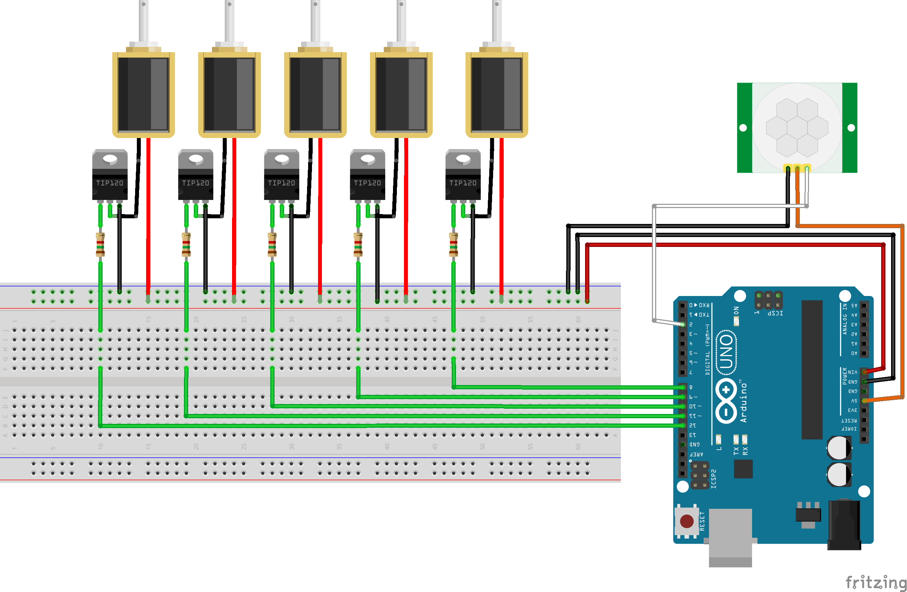

Spoooooky Chimes
================

When a person walks past, play a haunted melody on some old chimes. The chimes were pulled out of an old
house doorbell system. The main components include:
* Arduino Uno
* HC-SR501 passive IR motion sensor
* [12V solenoids from Adafruit](https://www.adafruit.com/product/413)
* TIP120 transistors

## Circuit Diagram

