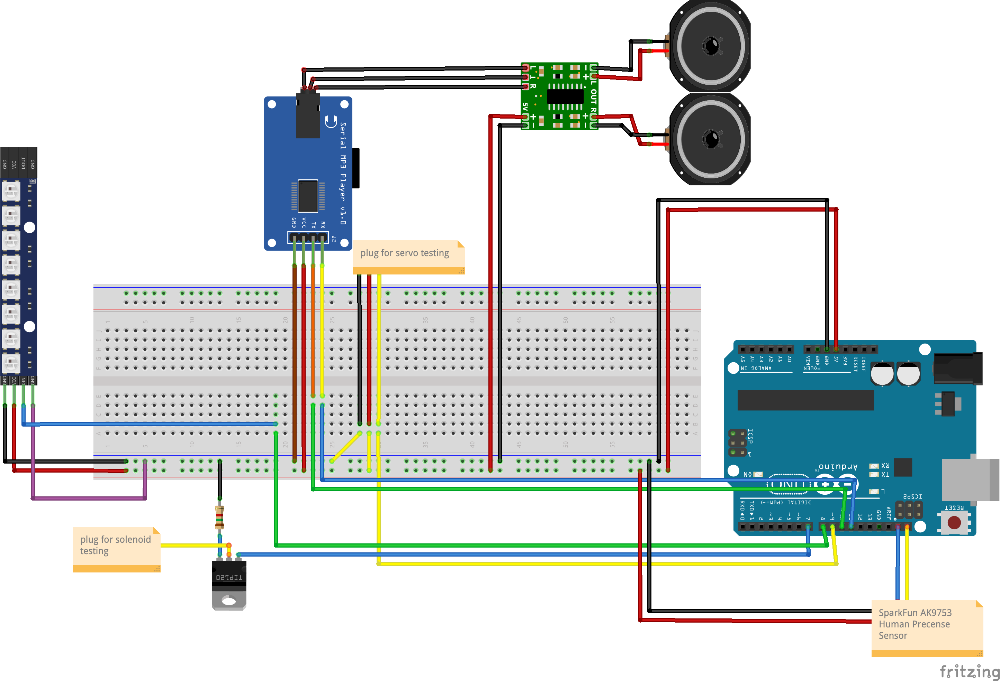

Strange Box
===========

When you put your hand on the box, it growls and lights up like a monster is inside. The main components include:
* Arduino Uno
* SparkFun AK9753 QWIIC human precense sensor
* HiLetGo YX5300 MP3 music module
* DROK 5W PAM8406 audio amplifier
* 27 LED NeoPixel strip ()
* 12V, 2.5A power adapter

## Circuit Diagram

